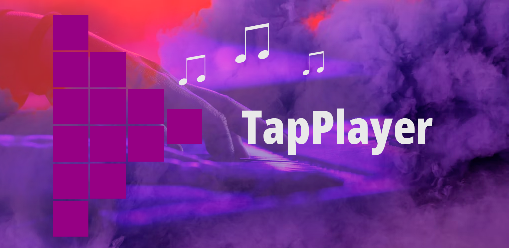

# TapPlayer

## Краткое описание

Плиточный музыкальный проигрыватель.

## Полное описание

Музыкальный проигрыватель для воспроизведения звуков и музыки по клику по плиткам. Это может быть полезно для организации небольших праздников и представлений, когда требуется периодически включать определенные звуки или музыку. Проигрыватель позволяет настроить размер сетки и назначить каждой ячейке музыкальный файл, цвет и название.
